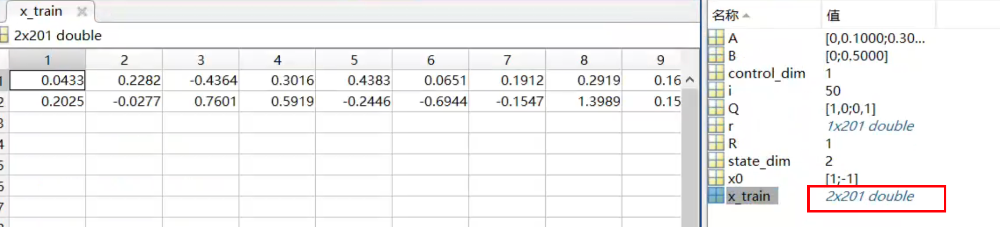
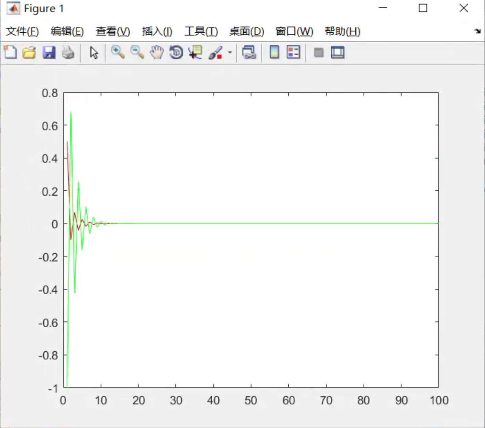
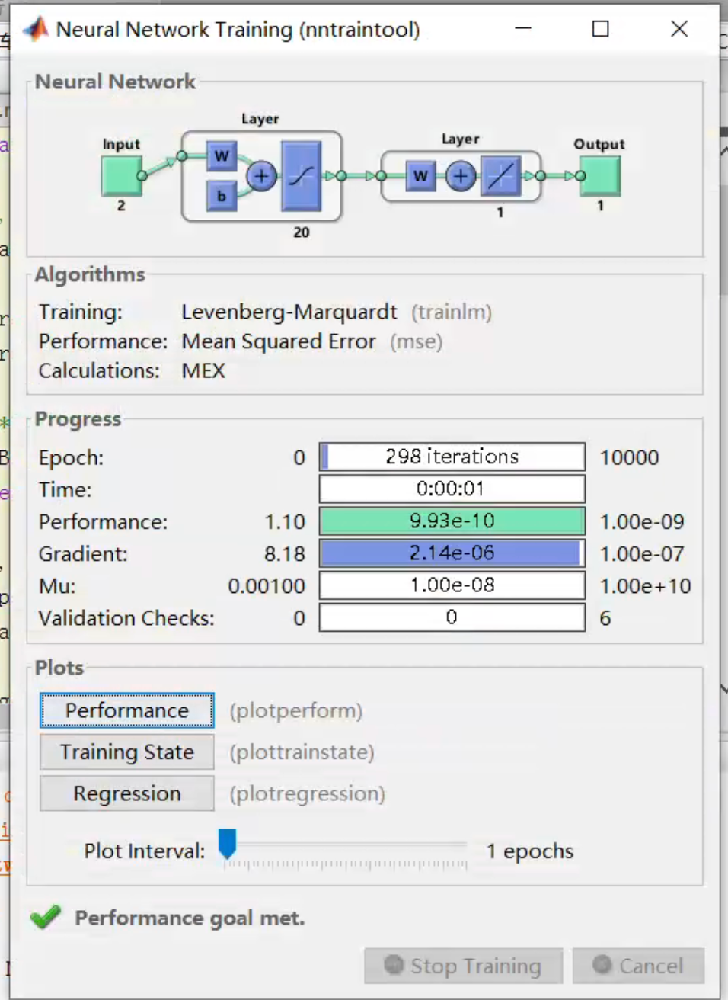
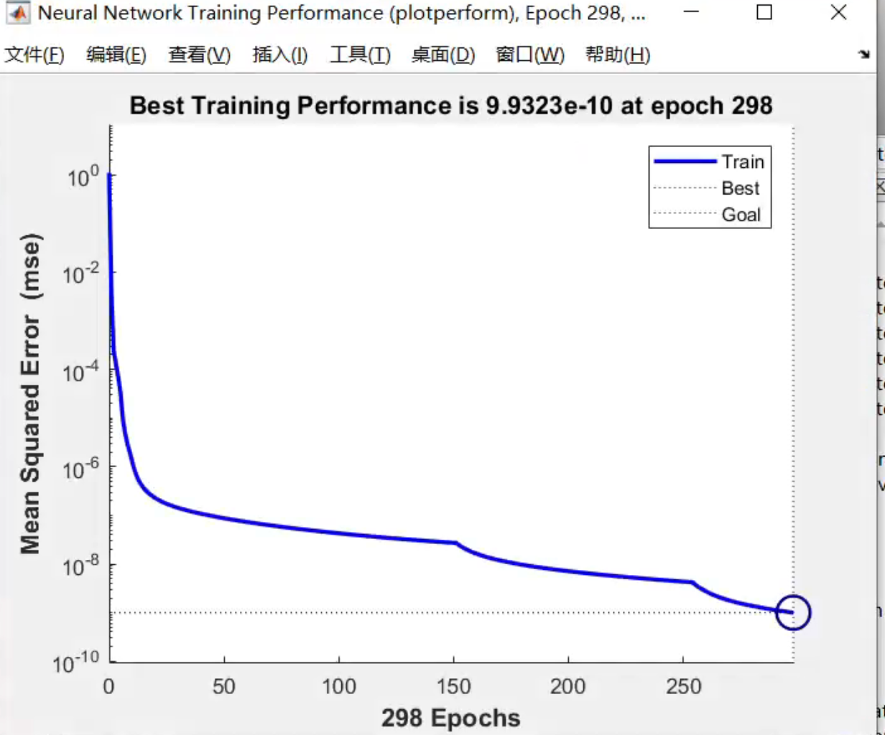
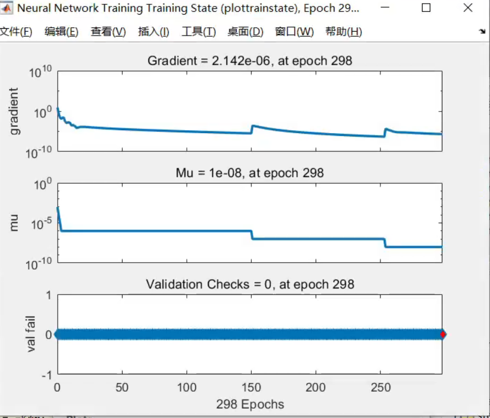

#   介绍
本项目为针对使用actor-critic控制器的简易二阶系统仿真。

仿真智能车的运行效果参考本人b站视频：https://www.bilibili.com/video/BV1dt4y1x7Gw/?spm_id_from=333.999.0.0&vd_source=2b244264ade527200c2b6e186136b480#/

#   使用
运行顺序：
1. 执行pi_state_data.m，产生初始数据
2. 再运行pi_icp.m，训练初始actor_init网络
3. 最后运行pi_algorithm.m，里面利用actor_init网络当作初始控制器，训练critic网络，再训练actor网络，再训练critic，再训练actor...

#   运行说明
## 一. 产生200组初值
执行 pi_state_data.m

## 二. 训练初始actor控制器
执行 pi_icp.m

1. 人为给定初始$Q$和$R$，得出初始容许控制$K_0$;
2. 系统在200组初值和初始容许控制$K_0$的条件下运行，采集得到200组数据$\{e_{rr}(t), u\}$;
3. 训练$\text{actor}$控制器使得$f_{actor}(e_{rr}(t); w)$的输出为$u$。

## 三. 循环训练critic控制器和actor控制器
执行pi_algorithm.m

1. 给定期望的$Q$和$R$，作为我们期望的最优性能指标函数；
2. 系统在200组初值和（二）中训练得到的actor控制器下运行，采集得到200组数据$\{e_{rr}(t), u\}$；
3. 计算$N$组性能指标函数$J=\int_{t_0}^{\infty}(e_{rr}^T(t)Qe_{rr}(t)+u^T(t)Ru(t))dt$
4. 训练$\text{critic}$控制器使得$f_{critic}(e_{rr}(t), u; \theta)$的输出为$J$。
5. 构造$F(u)=r_t + \gamma f_{critic}(e_{rr}(t), u; \theta)$，计算$u^\ast = \min_{u}F(u)$，得到新的数据集$\{e_{rr}(t), u^\ast\}$

